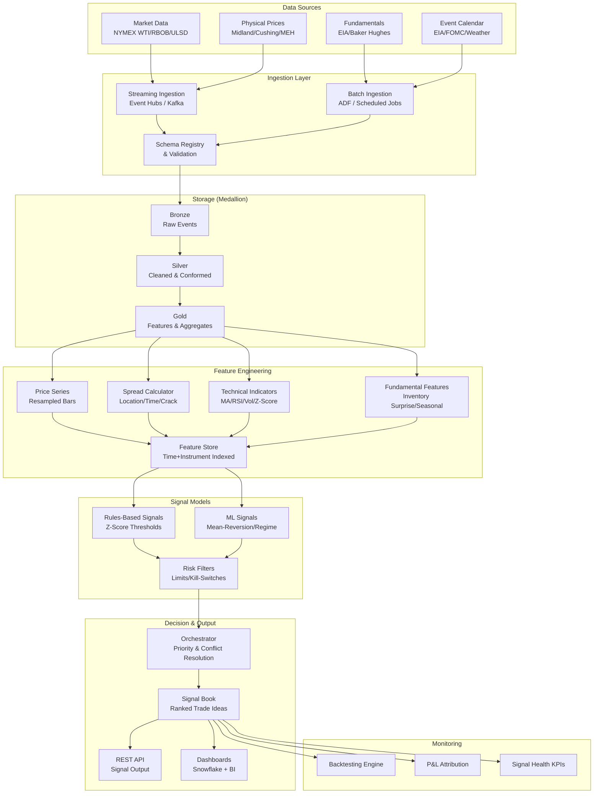

# MarketSensing - Oil & Gas Trading Signal Platform

## Project Overview

A **market-sensing and trading-signal platform** for a US-focused oil & gas trading organization. The system generates actionable **Buy/Sell signals** across three arbitrage dimensions:

- **Time arbitrage** — futures curve shape (contango/backwardation)
- **Location arbitrage** — price differences between US physical hubs
- **Refining margin (crack) arbitrage** — hedging and optimizing refinery margins

Signal-only in v1 (no direct execution). Designed for a future order-management/execution layer.

---

## Architecture Overview



---

## Trading Concepts → System Components Mapping

| Trading Concept | System Module | Key Features |
|---|---|---|
| Buy Low, Sell High (directional) | Signal Models → Rules + ML | Z-scores, RSI, mean-reversion models |
| Spread Arbitrage (relative value) | Feature Engineering → Spread Calculator | Location spreads, crack spreads |
| Time Arbitrage (term structure) | Feature Engineering → Price Series + Signal Models | Contango/backwardation detection, storage economics |

---

## Tech Stack

| Layer | Technology |
|---|---|
| Streaming Ingestion | Azure Event Hubs / Kafka |
| Batch Ingestion | Azure Data Factory (ADF) |
| Compute / Pipelines | Databricks / Spark (PySpark) |
| Storage | Delta Lake (medallion) + Snowflake (analytics) |
| ML Lifecycle | MLflow |
| Feature Store | Databricks Feature Store / custom Delta tables |
| API | FastAPI (Python) |
| Dashboards | Power BI / Streamlit |
| Orchestration | Databricks Workflows / Airflow |
| Language | Python 3.11+ |

---

## Project Structure

```
marketsensing/
├── CLAUDE.md                          # Project memory & instructions
├── README.md                          # Quick start guide
├── pyproject.toml                     # Python project config
├── .gitignore                         # Git ignore rules
│
├── docs/                              # Architecture & specs
│   ├── architecture.md                # System architecture overview
│   ├── decisions/                     # Architecture decision records (ADRs)
│   │   ├── 001-medallion-architecture.md
│   │   ├── 002-config-driven-signals.md
│   │   └── 003-signal-only-v1.md
│   ├── runbooks/                      # Operational runbooks
│   │   └── eia-report-day.md
│   ├── schemas/                       # Data schemas (Bronze/Silver/Gold)
│   │   ├── bronze.md
│   │   ├── silver.md
│   │   └── gold.md
│   └── api/                           # API contracts
│       └── signal-api-contract.md
│
├── .claude/                           # Claude Code configuration
│   ├── settings.json                  # Permissions & settings
│   ├── hooks/                         # Automation hooks
│   │   └── pre-commit.sh
│   └── skills/                        # Reusable AI workflows
│       ├── code-review/
│       │   └── SKILL.md
│       ├── refactor/
│       │   └── SKILL.md
│       └── release/
│           └── SKILL.md
│
├── src/                               # Core application modules
│   ├── ingestion/                     # Data ingestion connectors
│   │   ├── streaming/                 # Real-time market data
│   │   └── batch/                     # EIA, rig counts, etc.
│   ├── features/                      # Feature engineering
│   │   ├── prices.py                  # Price resampling
│   │   ├── spreads.py                 # Spread calculations
│   │   ├── technicals.py             # Technical indicators
│   │   └── fundamentals.py           # Fundamental features
│   ├── signals/                       # Signal generation
│   │   ├── rules/                     # Rules-based signals
│   │   ├── ml/                        # ML-based signals
│   │   └── risk/                      # Risk filters & kill-switches
│   ├── orchestration/                 # Signal combination & decision
│   ├── api/                           # REST API for signal output
│   │   └── CLAUDE.md                  # API module context
│   ├── persistence/                   # Delta Lake & Snowflake storage
│   │   └── CLAUDE.md                  # Persistence module context
│   └── monitoring/                    # Backtesting, P&L, KPIs
│
├── config/                            # YAML configuration (never hard-code)
│   ├── instruments.yaml               # Instrument definitions
│   ├── strategies.yaml                # Strategy parameters & thresholds
│   ├── risk_limits.yaml               # Risk limits & kill-switches
│   └── schedules.yaml                 # Event & ingestion schedules
│
├── tools/                             # Development utilities
│   ├── scripts/                       # Helper scripts
│   └── prompts/                       # Prompt templates
│
├── notebooks/                         # Databricks / Jupyter notebooks
├── tests/                             # Unit and integration tests
└── infra/                             # IaC (Terraform/Bicep)
```

---

## Instruments (v1)

| Instrument ID | Description | Source |
|---|---|---|
| `WTI_CL_F1` | WTI front-month future | NYMEX |
| `WTI_CL_F3` | WTI 3-month future | NYMEX |
| `WTI_CL_F6` | WTI 6-month future | NYMEX |
| `WTI_CL_F12` | WTI 12-month future | NYMEX |
| `WTI_MIDLAND` | WTI Midland physical assessment | Platts/Argus |
| `WTI_CUSHING` | WTI Cushing physical assessment | Platts/Argus |
| `WTI_HOUSTON` | WTI Houston (MEH) physical assessment | Platts/Argus |
| `RBOB_F1` | RBOB gasoline front-month | NYMEX |
| `ULSD_F1` | ULSD diesel front-month | NYMEX |

---

## Signal Output Schema

All signals conform to this structure:

```json
{
  "signal_id": "uuid",
  "timestamp": "ISO-8601",
  "strategy_id": "spread_midland_cushing",
  "instrument_long": "WTI_MIDLAND",
  "instrument_short": "WTI_CUSHING",
  "action": "enter | exit",
  "side": "long_spread | short_spread",
  "size": 10,
  "confidence": 0.82,
  "expected_hold_time": "3d",
  "rationale": "Spread at -2.1 sigma below 60d mean",
  "model_version": "v1.2.0",
  "risk_checks_passed": true
}
```

---

## Delivery Phases

### Phase 1 — WTI Spreads + Simple Rules
- Ingest NYMEX WTI futures (EOD + delayed streaming)
- Physical hub prices (Midland, Cushing, Houston)
- Location spread features + z-score signals
- Time spread features + contango/backwardation signals
- Basic Signal Book API
- Backtesting framework

### Phase 2 — Crack Spreads + Regime Detection
- RBOB, ULSD ingestion
- 3-2-1 crack spread features + signals
- HMM / clustering regime detection
- Regime-aware signal gating
- EIA inventory surprise features
- Dashboard + P&L attribution

### Phase 3 — Natural Gas + Expansion
- Henry Hub + gas basis hubs (Waha, Chicago, Algonquin)
- Gas storage signals
- Full monitoring suite
- Execution layer integration design

---

## Conventions

- **Python**: PEP 8, type hints, `ruff` for linting
- **Config**: all thresholds/windows/limits in YAML, never hard-coded
- **Testing**: pytest, minimum 80% coverage for signal logic
- **Branching**: feature branches → `main` via PR
- **Commits**: conventional commits (`feat:`, `fix:`, `docs:`, etc.)
